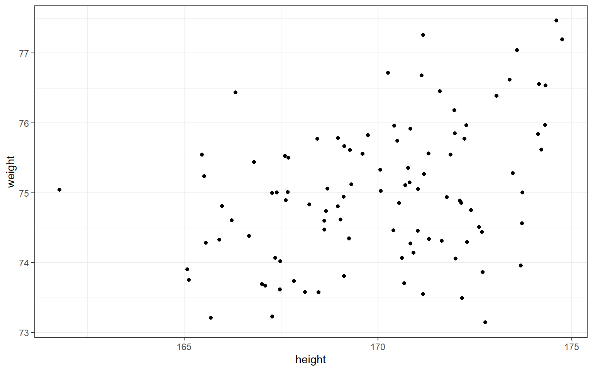

# Lab 4 

<div class="info">
<p>This is the last lab of semester 1 where the students willl work with data. Lab 5, the last lab of the semester, is where they present their reflections on what they would tell their fresher selves facilitating reflection on how far their skills have come in just 10 weeks. In this lab, lab 4, the students will again load in data, use the tidyverse verbs and generate a plot. Our students are also supported by a short video made by the course lead about ggplot.</p>
</div>

## Pre-class activity
Interesting twitter conversation between Prof Lisa Debruine and Dr Guillaume Rousselet on the importance of visualising data which you will be learning about in this lab 


### <span style="color:DARKGREEN"> dplyr Recap</span>

In [Lab 3](lab-3.html) we were introduced to the tidyverse package, `dplyr`, and its six important functions. As a recap, which function(s) would you use to approach each of the following problems?

* We have a dataset of 400 adults, but we want to remove anyone with an age of 50 years or more. To do this, we could use the <select class='solveme' data-answer='["filter()"]'> <option></option> <option>filter()</option> <option>arrange()</option> <option>select()</option> <option>group_by()</option> <option>mutate()</option> <option>summarise()</option></select> function.

* We are interested in overall summary statistics for our data, such as the overall average and total number of observations. To do this, we could use the <select class='solveme' data-answer='["summarise()"]'> <option></option> <option>summarise()</option> <option>group_by()</option> <option>select()</option> <option>filter()</option> <option>arrange()</option> <option>mutate()</option></select> function.

* Our dataset has a column with the number of cats a person has, and a column with the number of dogs. We want to calculate a new column which contains the total number of pets each participant has. To do this, we could use the <select class='solveme' data-answer='["mutate()"]'> <option></option> <option>summarise()</option> <option>filter()</option> <option>mutate()</option> <option>group_by()</option> <option>select()</option> <option>arrange()</option></select> function.

* We want to calculate the average for each participant in our dataset. To do this we could use the <select class='solveme' data-answer='["group_by() and summarise()"]'> <option></option> <option>group_by() and summarise()</option> <option>arrange() and mutate()</option> <option>group_by() and arrange()</option> <option>filter() and select()</option></select> functions.

* We want to order a dataframe of participants by the number of cats that they own, but want our new dataframe to only contain some of our columns. To do this we could use the <select class='solveme' data-answer='["mutate() and filter()","arrange() and select()"]'> <option></option> <option>select() and summarise()</option> <option>mutate() and filter()</option> <option>group_by() and mutate()</option> <option>arrange() and select()</option></select> functions.

### Intro to Plotting

Being able to visualise our variables, and relationships between our variables, is a very useful skill. Before we do any statistical analyses or present any summary statistics, visualising our variables is:

1. A quick and easy way to check our data make sense, and to identify any unusual trends.

2. A way to honestly present the features of our data to anyone who reads our research.

Plotting in R is especially easy and flexible, thanks to the tidyverse package, `ggplot2`. This lab will only cover the basics, but here is an example usage of `ggplot2` to plot some data:


```r
ggplot(my_data, aes(x = height, y = weight)) +
  geom_point()
```

<div class="figure" style="text-align: center">

<p class="caption">(\#fig:sim_dat_plot)Example plot of height by weight data.</p>
</div>

* `ggplot()` creates the ggplot object, which puts our data in a form that `ggplot2` can understand.

  + `my_data` is the dataset. This contains the ages and heights of my participants. Each row is a different participant.

  + The `aes()` function tells the plot which variables are plotted on which axes. On the x axis, we've put participants' heights, and on the y axis, their weights.

* `geom_point()` is a geom object which says what to actually do with all this information. Here, we tell ggplot2 to plot a point for each row (participant) in the dataset.

## In-class activities

### Getting our data ready to work with

Today in the lab we will be working with our data to generate a plot of two variables from the Woodworth et al. dataset. Before we get to generate our plot, we still need to work through the steps to get our data in the shape we need it to be in for our particular question. You have done these steps before so go back to the relevant script and use that to guide you through. Can you remember when we did this? 

OK, so what is our first step? Yup, thats right, we need to tell RStudio where to find all the files we need and pull them in ready for work. Let's go back to labs 2 and 3 to use our previous script to fill in the code in a new script:

### Activity 1: Packages and data

Open up tidyverse and read in data


<div class='solution'><button>Solution</button>


```r
library(tidyverse)
dat <- read_csv ('files/ahi-cesd.csv')
pinfo <- read_csv('files/participant-info.csv')
all_dat <- inner_join(dat, pinfo, by='id', 'intervention')
summarydata <- select(all_dat, ahiTotal, cesdTotal, sex, age, educ, income, occasion, elapsed.days)
```


</div>


### Activity 2: Select

Select the columns all_dat, ahiTotal, cesdTotal, sex, age, educ, income, occasion, elapsed.days from the data and creat variable ```summarydata```. 


<div class='solution'><button>Solution</button>


```r
summarydata <- select(all_dat, ahiTotal, cesdTotal, sex, age, educ, income, occasion, elapsed.days)
```


</div>


### Activity 3: Arrange

Arrange the data in the variable created above (```summarydata```) by ahiTotal with lowest score first.


<div class='solution'><button>Solution</button>


```r
ahi_asc <- arrange(summarydata, by = ahiTotal)
```


</div>


### Activity 4:Filter

Filter the data ```ahi_asc``` by taking out those who are over 65 years of age.


<div class='solution'><button>Solution</button>


```r
age_65max <- filter(ahi_asc, age < 65)
```


</div>


### Activity 5: Group and summarise

Group the data stored in the variable ```age_65max``` by sex, and store it in ```data_sex```. 
Then, use summarise to create a new variable ```data_median```, which calculates the median ahiTotal score in this grouped data and assign it a table head called ```median_score```.

*(Hint: if you're stuck, see [this dplyr documentation](https://dplyr.tidyverse.org/reference/group_by.html)).*


<div class='solution'><button>Solution</button>


```r
data_sex <- group_by(age_65max, sex)
data_median <- summarise(data_sex, median_score = median(ahiTotal))
```


</div>


### Activity 6: Mutate

Use mutate to create a new column called Happiness which categorises participants based on whether they score above or below the median ahiTotal score.


<div class='solution'><button>Solution</button>


```r
happy <- mutate(data_sex, Happiness = (ahiTotal > 73))
```


</div>


### The importance of plotting

We are now at the point where we can create a plot showing us some data. Why should we do this? This is an interesting thread from our colleagues Dr Guillaume Rousselet and Prof Lisa DeBruine on the reasons why we should use plots and the benefits of using ggplot, the package we will use today in RStudio, to create our plot: https://twitter.com/robustgar/status/1025342313004974080

And as Grolemund and Wickham tells us:
"Visualisation is a fundamentally human activity. A good visualisation will show you things that you did not expect, or raise new questions about the data. A good visualisation might also hint that you’re asking the wrong question, or you need to collect different data. Visualisations can surprise you, but don’t scale particularly well because they require a human to interpret them."
http://r4ds.had.co.nz/introduction.html


<div class='solution'><button>Solution</button>


```r
ggplot(data = age_65max, mapping = aes(x = ahiTotal , y = cesdTotal)) + 
  geom_point(col="purple")
```

<div class="figure" style="text-align: center">

<p class="caption">(\#fig:createplot)Happiness scores for participants aged less than 65 years</p>
</div>


</div>


Great job! You have now worked with the essential basics of good practice in data wrangling! To show us how you have mastered this complete the assessment and submit by 12pm 1 week from your lab. 
