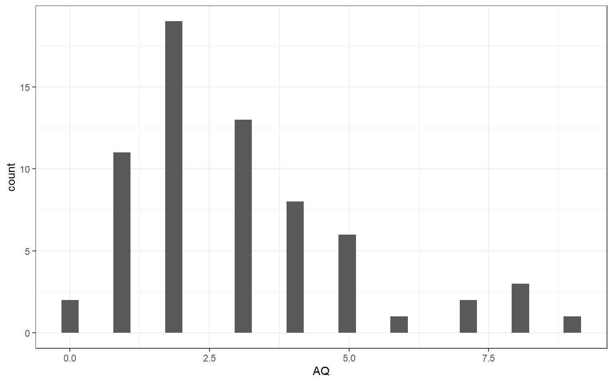

# Lab 6

<div class="info">
<p>This lab builds on the skills developed to date by using pipes to join lines of previously used tidyverse verbs. In addition to the <strong>pre-class activity</strong>, you might find it useful to revisit previous in-class activities, assessments and feedback to recap skills developed to date.</p>
</div>


## Pre-class activity

### What are pipes?

Pipes in R look like this: `%>%`

Pipes are a handy feature of the tidyverse that allow you to send the output from one function straight into another function. Specifically, they send the result of the function before `%>%` to be the first argument of the function after `%>%`.

Here's an imaginary example showing how using pipes can simplify our code:

<p class='left-float' align='center'><b>Without Pipes</b></p>

<p class='right-float' align='center'><b>With Pipes</b></p>

<div class = 'left-float'>

```r
library(tidyverse)

raw_data <- read_csv("my_data.csv")
sel_data <- select(raw_data, id, age, score)
clean_data <- filter(sel_data, age >= 18)
final_data <- arrange(clean_data, score)
```

</div>

<div class = 'right-float'>

```r
library(tidyverse)

final_data <- read_csv("my_data.csv") %>%
  select(id, age, score) %>%
  filter(age >= 18) %>%
  arrange(score)
```

</div>

As you can see, pipes save us a lot of typing, and can make our code much more readable. Thanks to pipes, we can also keep our environment clean of intermediary variables that we only ever use once (i.e., we have no need for the variables `raw_data`, `sel_data`, or `clean_data`; we just save the result straight to `final_data`).

Pipes might seem a little confusing at first - one way to make it easier to understand what your code is doing is to translate what your code is doing into English. You could pronounce `%>%` as `then`. For example, you might read the above code on the right (with pipes) as saying:

"read the csv **then** select the columns `id`, `age`, and `score` **then** filter to only include ages of 18 or greater **then** arrange (sort) by `score`"

<br>
<div class="danger">
<p>As great as pipes are, there are two main cases when it probably makes sense to write your code without pipes, and save the results from each step to separate variables:</p>
<ol style="list-style-type: decimal">
<li><p>When the output from a step partway through your pipeline is somehow useful. For example, you might want to check that a step worked as expected, or the information might be useful again later on.</p></li>
<li><p>When you’re completing assessments and we want you to save the output from a certain step to a specific variable name (we want to check that the step worked properly to be able to give you the mark!).</p></li>
</ol>
</div>

#### <span style="color:DARKGREEN"> Quickfire Questions</span>

Which of the following is a pipe? <select class='solveme' data-answer='["%>%"]'> <option></option> <option>%>%</option> <option>&</option> <option>></option> <option>==</option></select>

Where do pipes send the result of the function that precedes the pipe? <select class='solveme' data-answer='["To the first argument of the next function."]'> <option></option> <option>To the third argument of the 18th function.</option> <option>To Ibiza.</option> <option>To the last argument of the next function.</option> <option>To the first argument of the next function.</option></select>

Are pipes a super-cool feature of the tidyverse that makes your code more readable and less verbose? <select class='solveme' data-answer='["yes","yes","yes","yes"]'> <option></option> <option>yes</option> <option>yes</option> <option>yes</option> <option>yes</option></select>

## Inclass activities

### Activity  1: library 

We are going to be working with the Autism Quotient (AQ) data which you have already been introduced to in lab 5 and in the pre-class for this lab. The relevant data required to use this data comes in 3 separate files; the survey responses 'responses.csv', the question formats 'qformats.csv' and scoring info 'scoring.csv'. To get us started, load in tidyverse.


<div class='solution'><button>Solution</button>


```r
# load in tidyverse by replacing this line
library(tidyverse)
```


</div>


### Activity 2 : read_csv

Read in the data to create the objects ```responses```, ```qformats``` and ```scoring``` using the corresponding data files for each tibble i.e. responses for the response data, qformats for the question formats and scoring for the scoring info.


<div class='solution'><button>Solution</button>


```r
responses <- read_csv("files/responses.csv") 
qformats <- read_csv("files/qformats.csv") 
scoring <- read_csv("files/scoring.csv") 
```


</div>


**Checkpoint** Has the data now appeared in the environment? Take a look and make sure each objects looks as you would expect it to. Does the data look the same as it did in the .csv files? Is it in the format ideal for analysis (see lab 1 in-class and lab 2 prep for a clue)?

### Activity 3: gather

Let's get this data into long format from wide format.Firstly, create ```rlong``` by using gather to show the question and response for each participant in long format (if you're struggling to understand gather, see lab 5 for more explanation about what each argument is doing).


<div class='solution'><button>Solution</button>


```r
rlong <- gather(data = responses, key = Question, value = Response, Q1:Q10)
```


</div>


### Activity 4: inner_join (QFormat)
Now use inner_join to add in the question format (QFormat) for each question and store it in ```rlong2```. This should now have 4 columns showing Id, Question, Response and QFormat.


<div class='solution'><button>Solution</button>


```r
rlong2 <- inner_join(rlong, qformats, "Question")
```


</div>


<div class='solution'><button>What should it look like?</button>


```
## # A tibble: 6 x 4
##      Id Question Response            QFormat
##   <dbl> <chr>    <chr>               <chr>  
## 1    16 Q1       Slightly Disagree   F      
## 2    17 Q1       Definitely Agree    F      
## 3    18 Q1       Definitely Agree    F      
## 4    19 Q1       Definitely Agree    F      
## 5    20 Q1       Definitely Disagree F      
## 6    21 Q1       Slightly Disagree   F
```


</div>


### Activity 5: inner_joint (scores)

We can now get the score for each participant for each question. Use inner_join to add in the score for each question and store it in ```rscores```. 


<div class='solution'><button>Solution</button>


```r
rscores <- inner_join(rlong2, scoring, c("QFormat", "Response"))
```


</div>


<div class='solution'><button>What should it look like?</button>


```
## # A tibble: 6 x 5
##      Id Question Response            QFormat Score
##   <dbl> <chr>    <chr>               <chr>   <dbl>
## 1    16 Q1       Slightly Disagree   F           0
## 2    17 Q1       Definitely Agree    F           1
## 3    18 Q1       Definitely Agree    F           1
## 4    19 Q1       Definitely Agree    F           1
## 5    20 Q1       Definitely Disagree F           0
## 6    21 Q1       Slightly Disagree   F           0
```


</div>


### Activity 6 - group_by

To calculate the AQ score for each participant, firstly we need to group the scores by Id. Using the tibble `rscores` defined in task 5, group the AQ scores by Id and store it in aq_scores1.


<div class='solution'><button>Solution</button>


```r
aq_scores1 <- group_by(rscores, Id)
```


</div>


### Activity 7: summarise

Now we have the scores grouped by Id, we can use summarise to calculate the sum of each question's score for each participant. Do this for ```aq_scores1``` and store it in ```aq_scores2```.  


<div class='solution'><button>Solution</button>


```r
aq_scores2 <- summarise(aq_scores1, AQ = sum(Score))
```


</div>


<div class='solution'><button>What should it look like?</button>


```
## # A tibble: 6 x 2
##      Id    AQ
##   <dbl> <dbl>
## 1    16     4
## 2    17     2
## 3    18     3
## 4    19     1
## 5    20     2
## 6    21     2
```


</div>


### Actvity 8: pipes

You might notice that we only actually use the tibble `aq_scores1` once, and it's not that useful to keep in our environment. Inspired by our new-found passion for pipes, we can actually complete activities 6 and 7 in one step!

Starting with the tibble `rscores` (calculated in activity 5), use pipes to calculate the AQ scores for each participant. Name this tibble `aq_scores` (make sure not to overwrite `aq_scores1` or `aq_scores2`).


<div class='solution'><button>Solution</button>


```r
aq_scores <- rscores %>%
  group_by(Id) %>%
  summarise(AQ = sum(Score))
```


</div>


<br>
**Checkpoint** Does ```aq_scores``` look the same as ```aq-scores2```? The code for activity 8 should do the same operations as activities 6 and 7, but in one step. As a result, `aq_scores` from activity 8 should be identical to `aq_scores2` from activity 7.

### Activity 9: ggplot

Finally, show the distribution of the overall AQ scores by producing a histogram from aq_scores.


<div class='solution'><button>Solution</button>


```r
ggplot(aq_scores, aes(AQ)) + 
  geom_histogram()
```


</div>


<div class='solution'><button>What should it look like?</button>


<div class="figure" style="text-align: center">

<p class="caption">(\#fig:Q9a)Autism Quotient Score distribution.</p>
</div>


</div>


<br>

Well done! You should use this activity to help you complete the assessment to be submitted 1 week from your lab by 12pm. 
